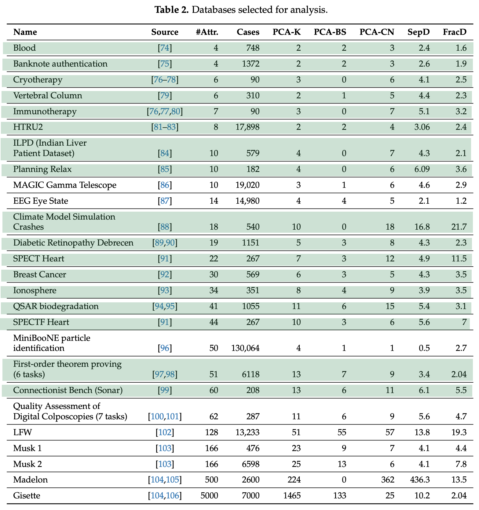
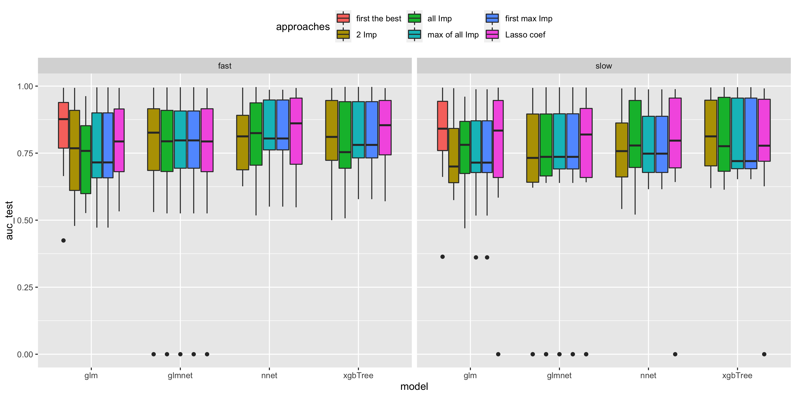
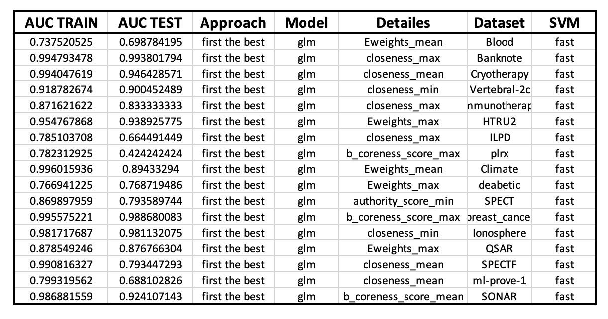
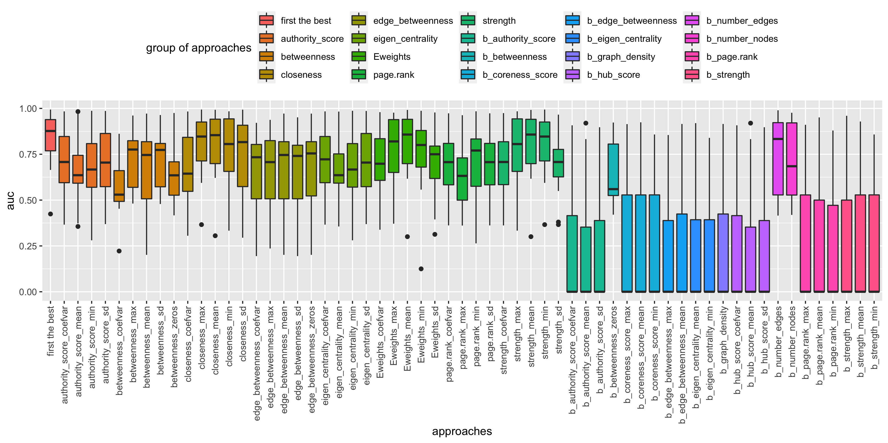
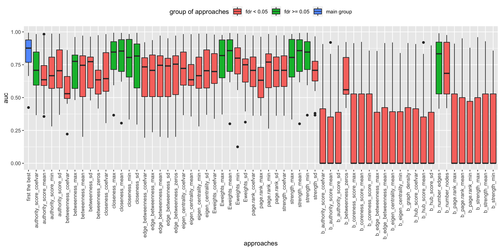
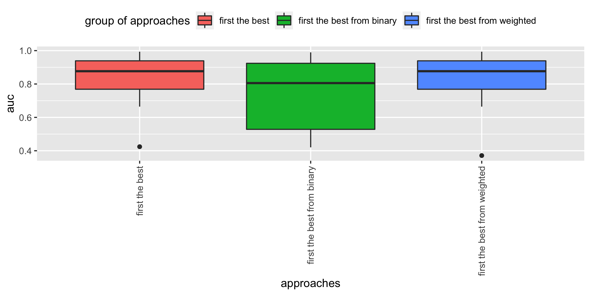
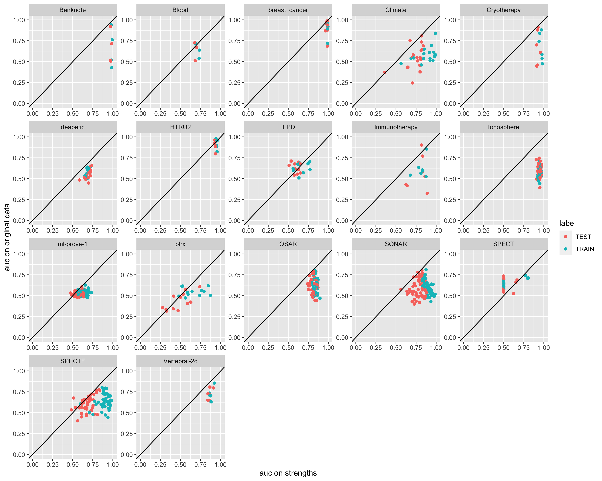
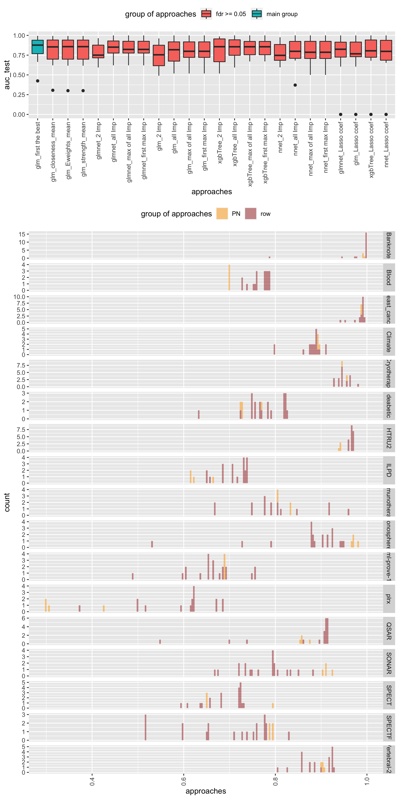
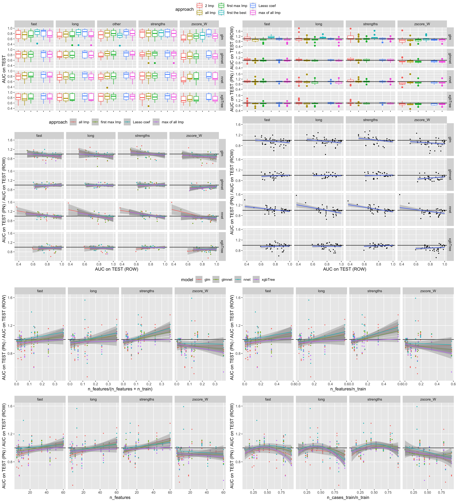

* [Datasets](data_info_all.xlsx)

# Table 2 (Gorban Paper)

## The procedure for choosing a strategy for building a model based on characteristics
### Legend:
#### Type of kernel SVM:
- **fast** - Parenclitic built with Radial SVM from *e1071* package 
- **long** - Parenclitic built with Radial SVM from *caret* package (fix parameters (sigma = 1, C = 1), cv)
#### Type of approache:
- **first the best** - Selection of the best characteristic on the Train (according to AUC) and apply to the Test. Calculation of AUCs on the Test.
- **Lasso coef** - With the help of a Lasso model, the choice of characteristics (on Train) with non-zero weights; building models on them (on Train); apply to the Test. Calculation of AUC on the Test.

*Approaches with Importance*:

Determination of the degree of importance of characteristics (varImp) according to Train
- **2 IMP** - Building a model on the two most important characteristics (on Train) and apply to thre Test. Calculation of AUC on the Test. 
- **all IMP** - Building a model on the all important characteristics (on Train) and apply to the Test. Calculation of AUC on the Test. 
- **max of all IMP** - Starting with the two most important characteristics step by step adding next important characteristic. At each step, calculating the AUC on Train. Choosing the set of characteristics where the absolute maximum is achieved. Apply of the model built on it to the Test. Calculation of AUC on the Test. 
- **first max IMP** - Starting with the two most important characteristics, step by step adding the following important characteristic. At each stage, the calculation of the AUC on Train. Choice of characteristics in which the first local maximum in AUC is reached. Apply of the model built on it to the Test. Calculation of AUC on the Test. 

**Conclusions:** 
- The best approach is the **first the best** (for each type of SVM). 
- **Fast** SVM is not inferior to **Slow** SVM (and it seems even superior).

### Checking each characteristic separately

### Paired Wilcoxon Test (with **first the best**, "greater")

### Checking Weighted or Binary

### Strengths of features VS row features

### PN vs ROW 

