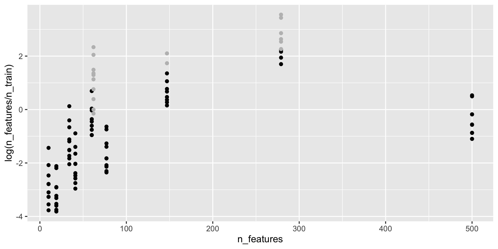

* [Datasets](data_info_all.xlsx)

# Results 
## Charactersictics

## Dependence AUC on features number 

## Dependence AUC on log ratio of features number and samples number

## Dependence AUC on cases fraction

